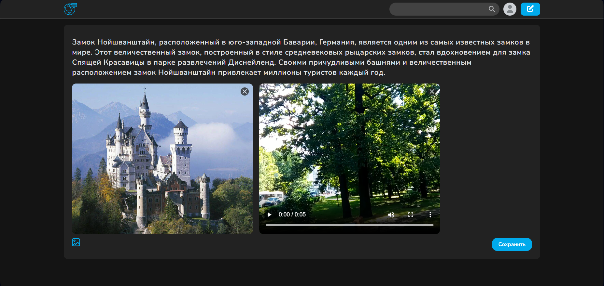
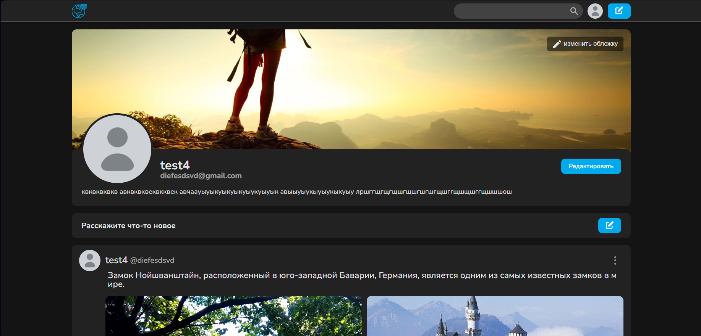
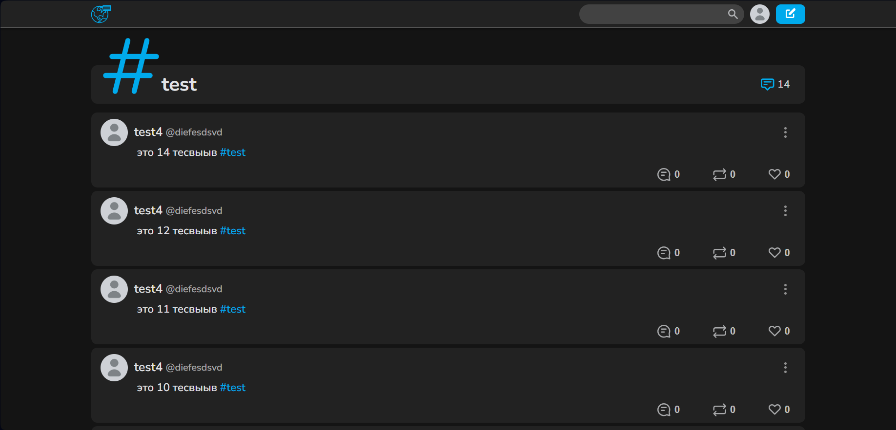
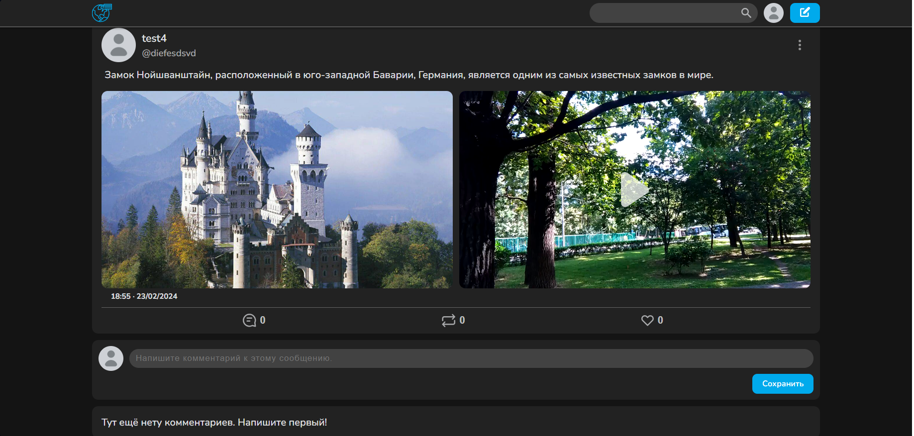
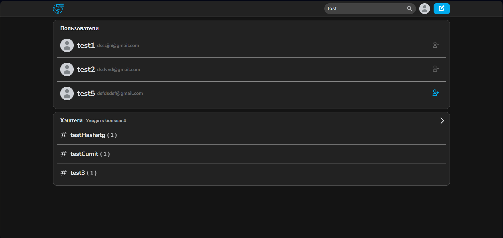

# Twitter-clone
#### Этот проект был создан в рамках школьного проекта в 10 классе, он представляет из себя "мини" социальную сеть

### *Было реализованно:* 
+ Добавление постов
+ Просмотр индивидуальной ленты постов
+ Индивидуальный профиль пользователя с просмотром его постов
+ Фильтрация постов по "*хештегам*"
+ Подписка на других пользователей (в проекте так сложилось , что это называется "*Друзьями*")
+ Поиск пользователей и хэштегов по подстроке 
+ Просмотр медиа-файлов в самописном слайдере
+ Смена цветовой-темы на темную и светлую
+ Кастомизация профиля
+ Комментирование постов
+ Добавление "*ретвитов*" (вторичная публикация постов со ссылкой на источник)
+ Реакции пользователя на посты ("*лайки*")

### *Установка:*
1. **Склонируйте репозиторий:**
   
   ```
   git clone https://github.com/DimaKozlovZib/twitter-clone.git
   ```
   
2. **Установите необходимые зависимости:**
   
   ```
   cd ./client
   npm install
   ```
   выполнять из корневого каталога
   ```
   cd ./server
   npm install
   ```
3. **Конфигурация:**
    Вам потребуется настроить файлы с константами в соответствии с вашими потребностями.

    (Как пример)

    **client/src/constans.js**
    ```javascript
    export const maxVisibleMedia = 4;
    export const maxAddMediaCount = 6;
    export const PROJECT_NAME = 'dreamscape';
    export const DOMAIN = 'http://localhost:3000/'
    ```
    **client/src/API/constans.js**
    ```javascript
    const httpUrl = (path = '') => 'http://localhost:5000' + (path.length ? '/' : '') + path

    export const REACT_APP_API_URL = httpUrl('api')

    export const REACT_STATIC_URL = httpUrl()//'static'
    export const STATIC_AVATARS_URL = httpUrl()//'static-avatars'

    const coverPath = ''//'static-cover'
    export const STATIC_COVER_URL = (fileName) =>
    (/static-header-image/.test(fileName) ? httpUrl(coverPath) : REACT_STATIC_URL) + '/' + fileName
    ```
    Значения в коментариях нужны для деплоя на облачный сервер

    **server/.env**
    ```
    PORT=5000
    POSTGRESDB=your_db_name
    POSTGRESUSER=db_user
    POSTGRESPASSWORD=your_password
    DB_HOST=localhost
    DB_PORT=5432
    SECRET_ACCESS_KEY=any_key
    SECRET_REFRESH_KEY=any_key
    CLIENT_URL=http://localhost:3000
    MONGO_URL=mongo_addres
    PATH_TO_DIST=..
    ```

4. **Запустите приложение:**
   
   из client
   ```
   npm start
   ```
   из server
   ```
   npm run dev
   ```
### *Обзор:*
+ Страница добавления поста

  

+ Страница пользователя

  

+ Страница хэштега

  

+ Страница комментирования поста

  

+ Страница поиска

  

### Автор:
Проект выполнил учащийся 10М класса (на момент написания 2024г) Козлов Дмитрий в **одиночку**